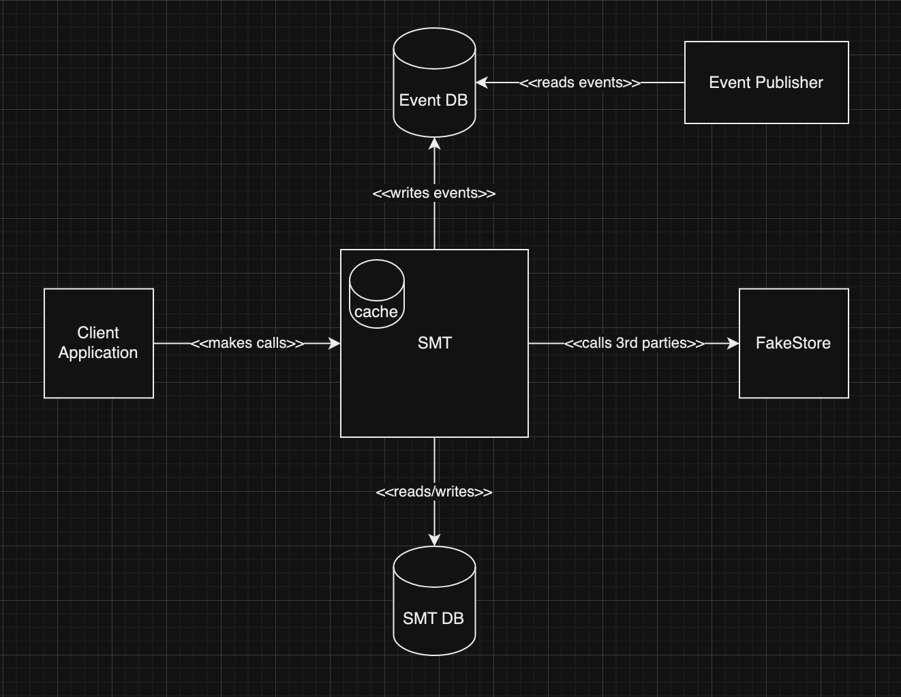
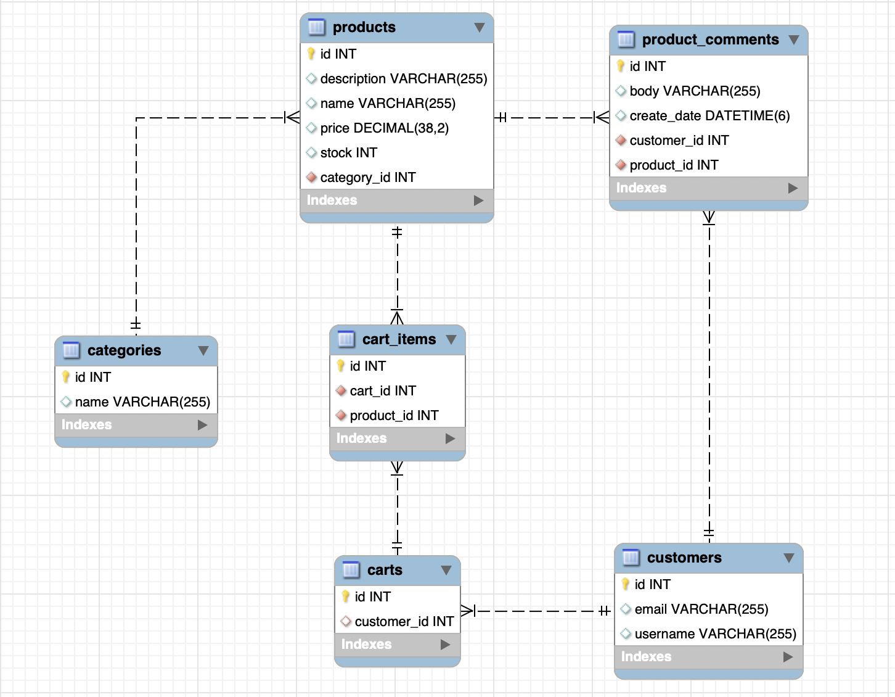

# store-management-tool

This tool is built using **Java** and **Spring Boot**, with **Spring Security** and **Spring Data JPA** to interact with a **MySQL database**, making it easy to manage and store important entities such as products, categories, customers, carts and more.

### Tech Stack
| Technology  | Version |
|:-----------:|:-------:|
|    Java     |   17    |
|   Gradle    |    7    |
| Spring Boot |  3.2.0  |
|    JUnit    | 5.10.0  |

### Project setup
* Build: `gradle build`
* Run: `gradle bootRun`

### Swagger
The APIs are documented and easily accessible through Swagger UI by accessing ```/docs``` endpoint.

### High level architecture


### Database schema - EER Diagram


### To Be Improved
**Security** - JWT Authentication and Role based access for endpoints

* expose ```/register``` and ```/login``` endpoints
* once the user is successfully authenticated we will generate a JWT token
* the generated JWT will be returned to a Client Application that will use it on every subsequent requests to authenticate the user so that user do not have to send the credentials anymore
* add roles for user and rules on ```SecurityFilterChain``` for accessing the endpoints based on roles

**Cart logic**
* improve cart logic and take in consideration things like total price, quantity for products, orders etc.

### To Be Added
* #### Add caching mechanism for trending products
* #### Idempotency mechanism
* #### Batch INSERTS/UPDATES/DELETES
* #### Pagination
* #### Event publishing
